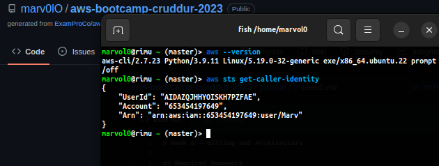
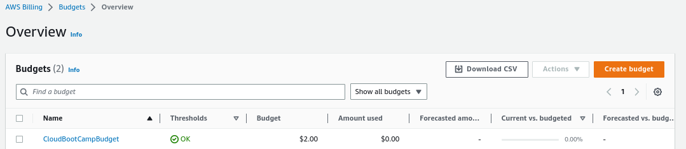

# Week 0 — Billing and Architecture

## Required Homework

### Install AWS CLI

I was able to use Gitpod to setup AWS CLI.

```CMD
aws --version
```



**More Proof of work**


### Creating Billing alarm and Budget

Succeded in creating a budget



- Was unable to successfully configure the bfg scrubbing tool but will keep at it.

### Recreate Logical Architecture Design


[Lucid Charts Share Link](https://lucid.app/lucidchart/invitations/accept/inv_d08dd0c9-452a-4537-abde-29777a66394b)


