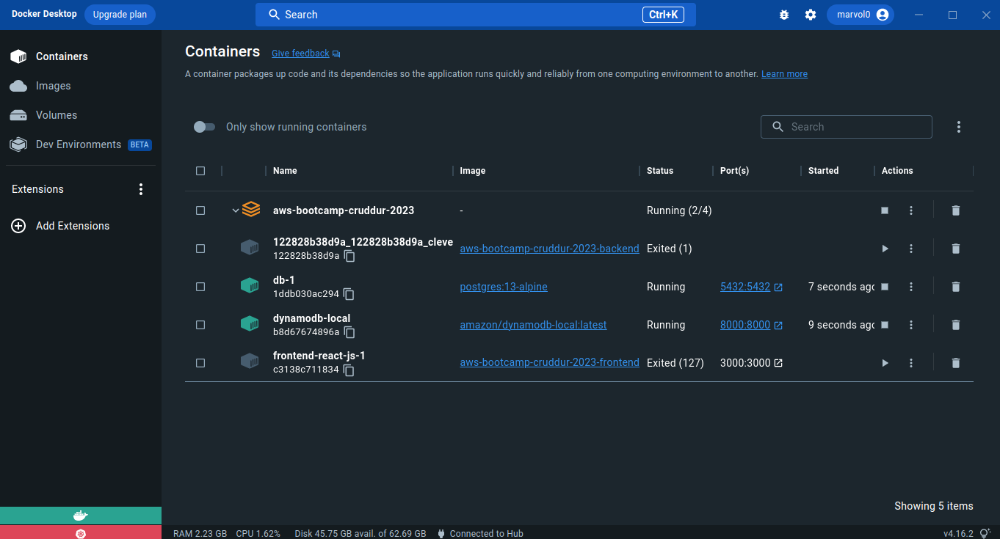
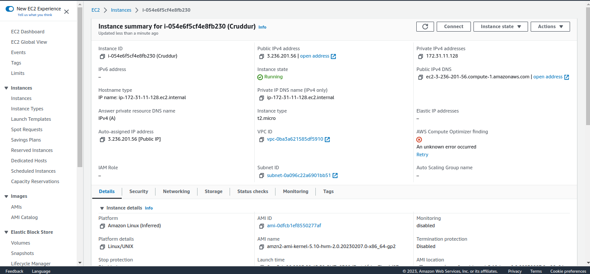
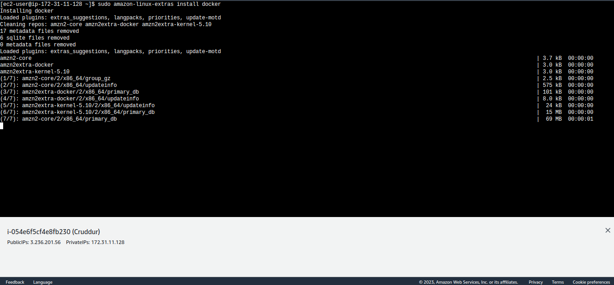
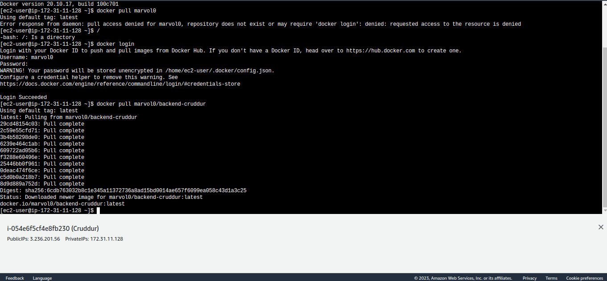
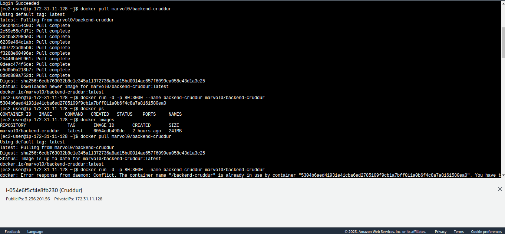

# Week 1 — App Containerization

### Containerize Backend and Frontend
Executed Docker-compose up and created images,
successfully opened port 4567 and got a JSON response back


### DynamoDB Local and PostgreSQL
Updated docker-compose file to include databases
Set up a db connection


Connected to the db through CLI client
```
sudo apt-get install -y postgresql-client
psql -h localhost -U postgres
```

## Homework Challenges

### Run Dockerfile CMD as an external script

1. Created **execute_script.sh** 
```
#!/bin/bash
python3 -m flash run --host=0.0.0.0 --port=4567
```
2. Created the container while in the backend-flask directory
```
docker build -t backend-flask .
```
3. Tried running the container
```
docker run -d --rm -p 4567:4567 -it -e FRONTEND_URL='*' -e BACKEND_URL='*' backend-flask
```
  

### Tag and push image to docker hub
1. Login to Docker Hub
```
docker login
```
2. Tag image
```
docker tag aws-bootcamp-cruddur-2023-backend-flask:latest marvol0/backend-cruddur:latest
```
3. Push image to Docker Hub
```
docker push marvol0/backend-cruddur:latest
```


4. Check Docker Hub Repo to verify push


### Multi-Stage Build

### Implementing Healthcheck in docker-compose
Adding health check
```
healthcheck:
      test: curl --fail -s http://localhost:4567/api/activities/home/ 
      interval: 30s
      timeout: 10s
      retries: 3 
```
### Best practices for writing Dockerfiles
- A Docker image consists of read-only layers each of which represents a Dockerfile instruction. The layers are stacked and each one is a delta of the     changes from the previous layer.
- Each instruction creates one layer:

  FROM creates a layer from the ubuntu:18.04 Docker image.
  COPY adds files from your Docker client’s current directory.
  RUN builds your application with make.
  CMD specifies what command to run within the container.
  
Reference [Docker Documentation](https://docs.docker.com/develop/develop-images/dockerfile_best-practices/)

### Run and install containers on local machine



Created a folder and cloned the cruddur repo

### EC2 Instance



Accessing the instance and installing docker
```
sudo amazon-linux-extras install docker
```



Pushed latest version of image in project workspace
```
docker login
docker push marvol0/backend-cruddur:latest
```

Pulling image from docker hub on EC2 instace



Running the container on instance




