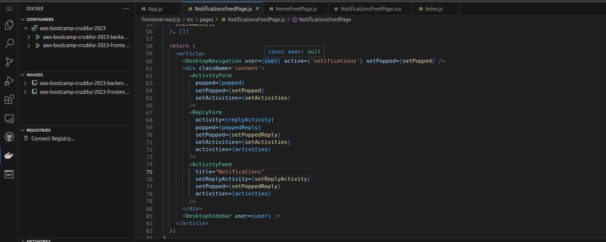
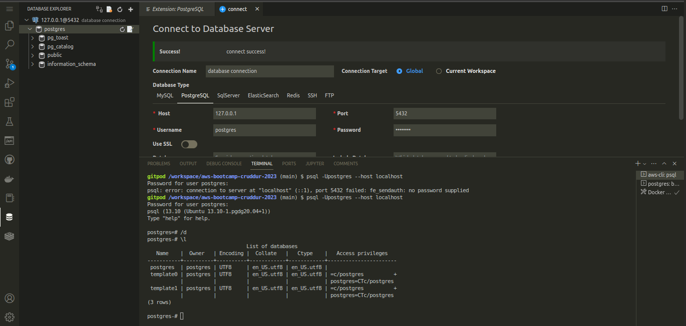
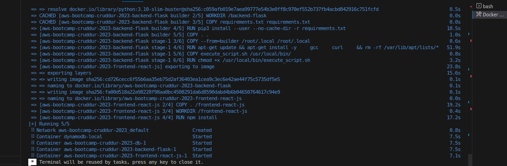
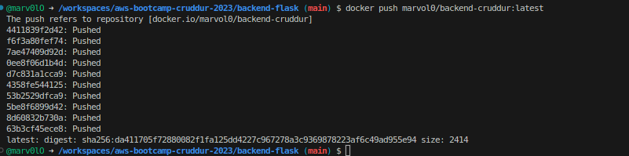
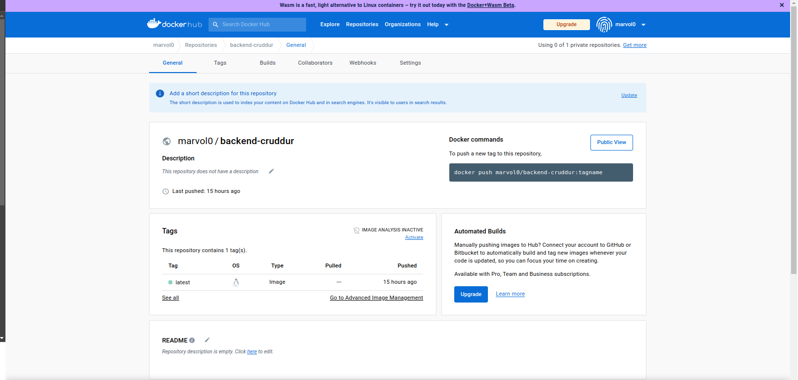

# Week 1 — App Containerization

### Containerize Backend and Frontend
Executed Docker-compose up and created images,
successfully opened port 4567 and got a JSON response back



### DynamoDB Local and PostgreSQL
Updated docker-compose file to include databases
Set up a db connection



Connected to the db through CLI client
```
sudo apt-get install -y postgresql-client
psql -h localhost -U postgres
```

## Homework Challenges

### Run Dockerfile CMD as an external script

1. Created **execute_script.sh** 
```
#!/bin/bash
python3 -m flash run --host=0.0.0.0 --port=4567
```
2. Created the container while in the backend-flask directory
```
docker build -t backend-flask .
```
3. Tried running the container
```
docker run -d --rm -p 4567:4567 -it -e FRONTEND_URL='*' -e BACKEND_URL='*' backend-flask
```
  

### Tag and push image to docker hub
1. Login to Docker Hub
```
docker login
```
2. Tag image
```
docker tag aws-bootcamp-cruddur-2023-backend-flask:latest marvol0/backend-cruddur:latest
```
3. Push image to Docker Hub
```
docker push marvol0/backend-cruddur:latest
```



4. Check Docker Hub Repo to verify push



