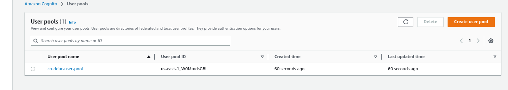
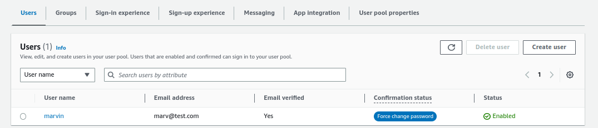
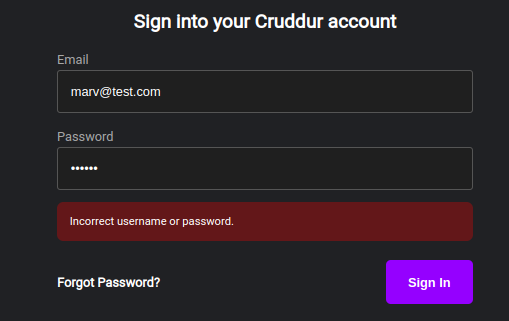
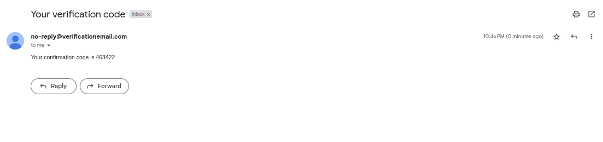
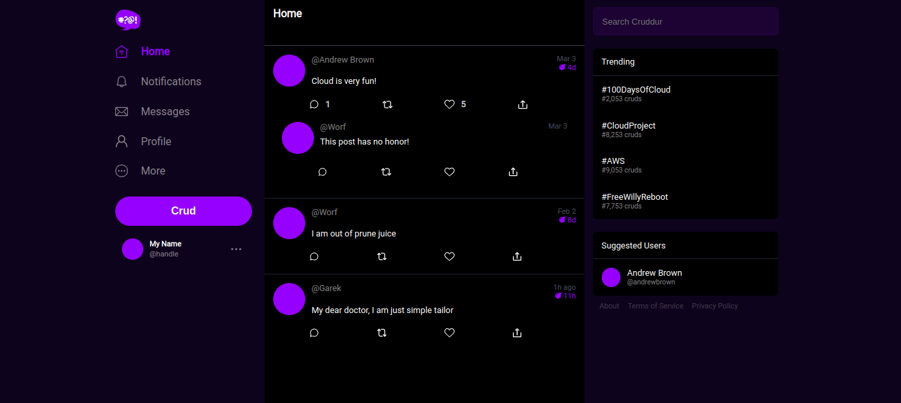

# Week 3 — Decentralized Authentication

## Technical tasks

- Setup Cognito User Pool

 
 
 #### AWS Amplify
 This is a development platform that offers a variety of tools and services for building scalable and secure cloud applications.
 It provides a set of client libraries and SDKs that can be used to connect frontend applications to backend services and enable real-time data synchronization.
 Amplify supports popular frontend frameworks and provides integrations with other AWS services such as AWS AppSync, AWS Lambda, and Amazon S3. It also includes features such as user authentication, authorization, and analytics, that help developers build secure and scalable applications quickly and easily.

- Installing AWS Amplify while in the frontend-react-js directory

```
npm i aws-amplify --save
```

- Configure Amplify in the app.js file

```
  import { Amplify } from 'aws-amplify';

Amplify.configure({
  "AWS_PROJECT_REGION": process.env.REACT_APP_AWS_PROJECT_REGION,
  "aws_cognito_identity_pool_id": process.env.REACT_APP_AWS_COGNITO_IDENTITY_POOL_ID,
  "aws_cognito_region": process.env.REACT_APP_AWS_COGNITO_REGION,
  "aws_user_pools_id": process.env.REACT_APP_AWS_USER_POOLS_ID,
  "aws_user_pools_web_client_id": process.env.REACT_APP_CLIENT_ID,
  "oauth": {},
  Auth: {
    // We are not using an Identity Pool
    // identityPoolId: process.env.REACT_APP_IDENTITY_POOL_ID, // REQUIRED - Amazon Cognito Identity Pool ID
    region: process.env.REACT_APP_AWS_PROJECT_REGION,           // REQUIRED - Amazon Cognito Region
    userPoolId: process.env.REACT_APP_AWS_USER_POOLS_ID,         // OPTIONAL - Amazon Cognito User Pool ID
    userPoolWebClientId: process.env.REACT_APP_CLIENT_ID,   // OPTIONAL - Amazon Cognito Web Client ID (26-char alphanumeric string)
  }
});
```

- Add Amplify env vars to docker-compose.yml

```
      REACT_AWS_PROJECT_REGION: "${AWS_DEFAULT_REGION}"
      REACT_APP_AWS_COGNITO_REGION: "us-east-1"
      REACT_APP_AWS_USER_POOLS_ID: "us-east-1_gaNJfNm6K"
      REACT_APP_CLIENT_ID: ""
```



- Configuring display of components once user is logged in 

##### Homefeed.js

```
//Add this to the import block
import { Auth } from 'aws-amplify';

//replace existing checkAuth function with the following function
const checkAuth = async () => {
  Auth.currentAuthenticatedUser({
    // Optional, By default is false. 
    // If set to true, this call will send a 
    // request to Cognito to get the latest user data
    bypassCache: false 
  })
  .then((user) => {
    console.log('user',user);
    return Auth.currentAuthenticatedUser()
  }).then((cognito_user) => {
      setUser({
        display_name: cognito_user.attributes.name,
        handle: cognito_user.attributes.preferred_username
      })
  })
  .catch((err) => console.log(err));
};
```
This code adds the Auth object from the aws-amplify library to the import block and replaces an existing checkAuth function with a new one that uses Auth to check if the user is authenticated and retrieve their attributes.

##### ProfileInfo.js

```
//Add this to the import block
import { Auth } from 'aws-amplify';

//replace existing signOut function with the following function
  const signOut = async () => {
    try {
        await Auth.signOut({ global: true });
        window.location.href = "/"
    } catch (error) {
        console.log('error signing out: ', error);
    }
  }
```
This code adds the Auth object from the aws-amplify library to the import block and replaces an existing signOut function with a new one that uses Auth to sign the user out and redirect them to the home page.

##### SigninPage.js

```
import { Auth } from 'aws-amplify';

const onsubmit = async (event) => {
  setErrors('')
  event.preventDefault();
  Auth.signIn(email, password)
  .then(user => {
    localStorage.setItem("access_token", user.signInUserSession.accessToken.jwtToken)
    window.location.href = "/"
  })
  .catch(error => {
    if (error.code == 'UserNotConfirmedException') {
      window.location.href = "/confirm"
    }
    setErrors(error.message)
  });
  return false
}
```
This code imports the Auth object from the aws-amplify library and defines an onsubmit function that handles a form submission event.

- Manually verifying the user

```
aws cognito-idp admin-set-user-password --user-pool-id "us-east-1_EsWorbtLo" --username nickda --password REDACTED --permanent
```




- verification email





- Implementing Custom Signup, Confirmation and Recovery Page


